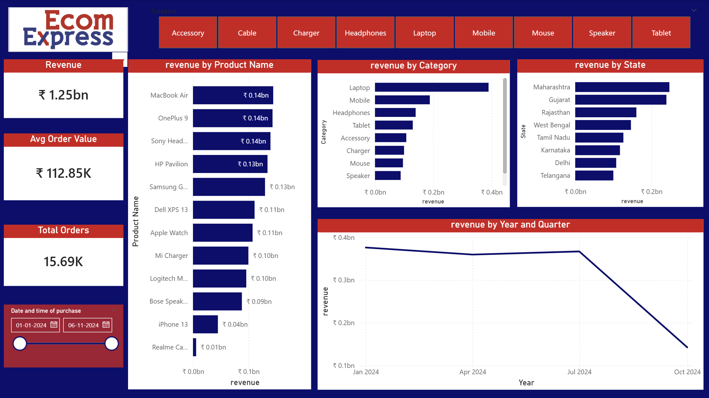
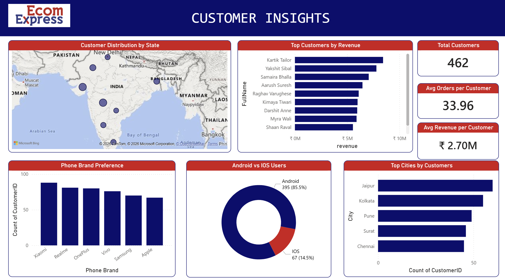
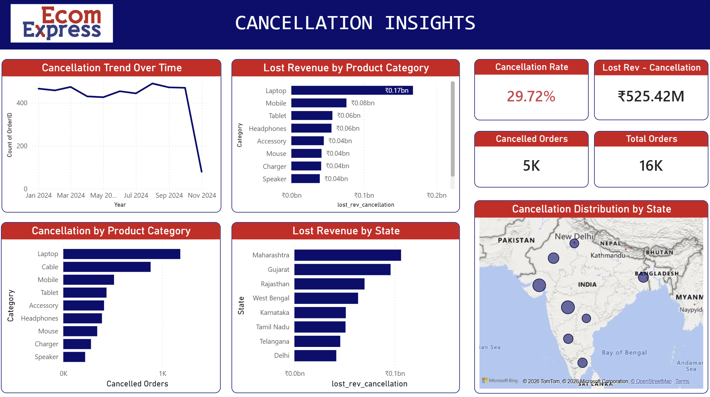

# Power BI E-commerce Sales Analysis

## Project Overview
This project presents an interactive Power BI dashboard built on an e-commerce dataset. It focuses on analyzing sales performance, customer behavior, and order cancellations to uncover meaningful business insights.

---

## Dashboard Sections

### 1. Revenue Insights
- Total Revenue, Total Orders, and Average Order Value
- Revenue breakdown by product category and state
- Revenue trends over time (monthly/quarterly)
- Top-performing products by revenue

### 2. Customer Insights
- Customer distribution across states
- Top customers by revenue contribution
- Average orders and revenue per customer
- Phone brand preferences
- Android vs iOS user distribution
- Top cities by customer count

### 3. Cancellation Insights
- Overall cancellation rate and total cancelled orders
- Cancellation trends over time
- Cancellation by product category
- Cancellation distribution across states
- Lost revenue due to cancellations (by category & state)

---

## Dataset
- E-commerce orders dataset used for analysis  
- Includes:
  - Order details  
  - Product categories  
  - Customer information  
  - Delivery and cancellation data  

---

## Skills Demonstrated
- Data Cleaning & Transformation (Power Query)
- Data Modeling
- DAX Calculations (KPIs, Measures)
- Data Visualization & Dashboard Design
- Business Insights Generation

---

## Tools Used
- Power BI
- DAX
- Power Query

---

## Key Insights
- Certain product categories contribute significantly to lost revenue due to cancellations  
- High-value customers drive a large portion of total revenue  
- Sales show variation across states, highlighting regional performance differences  
- Delivery delays may be linked to higher cancellation rates  

---

## Conclusion
This dashboard helps in understanding overall business performance, identifying problem areas like cancellations, and supporting data-driven decision-making for improving revenue and customer experience.

---

## Dashboard Preview

### Revenue Insights

### Customer Insights

### Cancellation Insights

